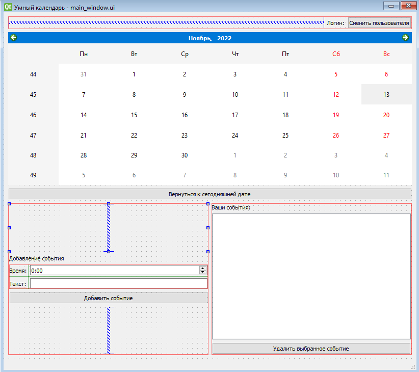
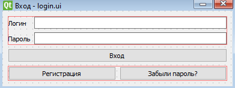
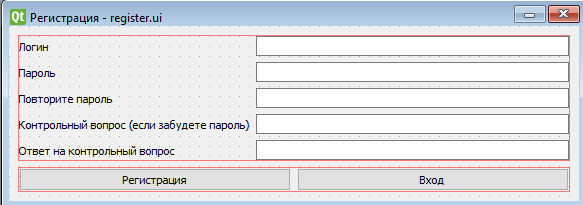
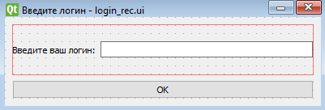
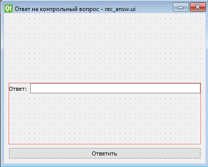

Техническое задание
1. Название проекта: SmartCalendar (Умный календарь)
2. Над проектом работал: Молчанов Степан Андреевич. Учитель - Анатольев Алексей Владимирович
3. Описание программы. Умный календарь способен создавать события (напоминания) для различных пользователей. Напоминания срабатывают за сутки и за час до установленного времени.
4. Структура проекта.
    При входе пользователя в программу: main.py -> (Запуск кода окна) -> main_window.py -> (Открытие окна входа) -> login_dialog.py -> (Запрос инофрмации о пользователе в базе данных, вход, передача данных в код главного окна) -> main_window.py (Открытие окна)
    Регистрация пользователя: main.py -> (Запуск кода окна) -> main_window.py -> (Открытие кона входа) -> login_dialog.py -> (Открытие окна регистрации) -> register_dialog.py -> (Добавление пользователя в базу данных) -> main_window.py (Открытие окна)
    Восстановление пароля: main.py -> (Запуск кода окна) -> main_window.py -> (Открытие окна входа) -> login_dialog.py -> (Запуск кода окна восстановления пароля) -> rec_dialog.py -> (Запуск кода окна проверки ответа на контрольный вопрос) -> rec_answ_dialog.py -> (Ввод логина пользователя) -> login_rec_dialog.py -> (Передача логина пользователя) -> rec_answ_dialog.py -> (Проверка ответа на контрольный вопрос) -> rec_dialog.py -> (Смена пароля) -> login_dialog.py -> (Вход) -> main_window.py (Открытие окна)
    Для работы с базой данных используются функции из файла db_tools.db. Для кодировки/раскодировки строк, а также проверки пароля, используются функции из файла diff_tools.py.
5. План кода:
    1. Константы: STEP = 17. Константа STEP задаёт шаг кодировки логина, пароля и т.д. в базе данных.
    2. Функции: encrypt, decrypt, passwd_check, db_add_event, db_get_events, db_delete_event, db_check_for_event, db_search_event, db_login, db_register, db_get_user_data, db_check_answer, db_change_passwd, db_get_query. Первые две функции кодируют и декодируют строки при передаче их между кодом программы и базой данных. Функция passwd_check проверяет пароль на соответствие базовым критериям. Остальные функции, начинающиеся на "db_", позволяют производить различные операции для взаимодействия кода программы и базы данных.
    3. Классы: Ui_LoginDialog, LoginDialog, Ui_LoginRecDialog, LoginRecDialog, Ui_MainWindow, MainWindow, Ui_RecAnswDialog, RecAnswDialog, Ui_RecDialog, RecDialog, Ui_RegisterDialog, RegisterDialog, Event, User. Классы, начинающиеся на "Ui_", являются формами. Классы Event и User описывают события и пользователей соответственно. Остальные классы реализуют работу окон в программе.
    4. Библиотеки: PyQt5 для реализации графического интерфейса, pymorphy2 для согласования существительных с числительными в уведомлениях.
6. Графический интерфейс  
  
      
    Главное окно  
  
      
    Окно входа  
  
      
    Окно регистрации  
  
      
    Окно ввода логина для восстановления пароля  
  
      
    Окно ответа на контрольный вопрос для восстановления пароля  
  
      
    Окно восстановления пароля    
  
7. Дедлайн. Проект сделан за неделю (с 6 ноября по 13 ноября включительно)
