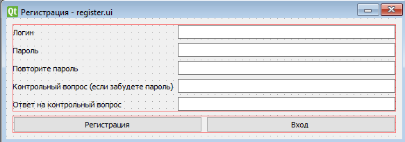
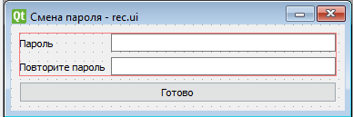
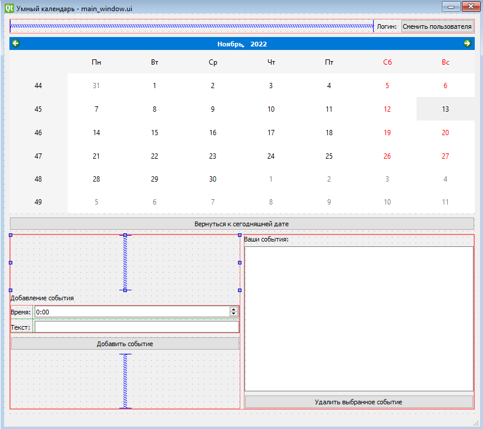

# SmartCalendar
Представляет собой графический интерфейс календаря, который позволяет создавать события с определённой датой.  
## Запуск:
1. (cmd/bash): `cd (ProjectPath)/Qt_SmartCalendar`
2. `pip install -r requirements.txt`
3. `main.py`  
## Работа приложения
При запуске нас первым делом встречает окно ввода логина и пароля:  
  
Мы можем зарегистрироваться..:  
  
...восстановить забытый пароль...:  
  
...или, наконец, войти в программу:  
  
Весь интерфейс главного окна программы интуитивно понятен.
## Скринкасты работы приложения
- Добавление и удаление события: screencasts/adding_event.mp4
- Смена пользователя: screencasts/user_changing.mp4
- Регистрация в программе: screencasts/registering.py
